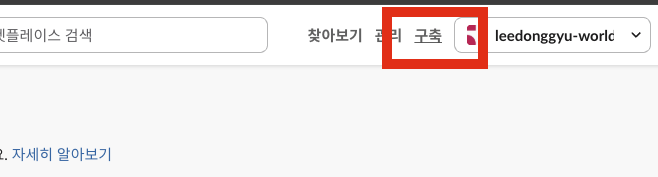
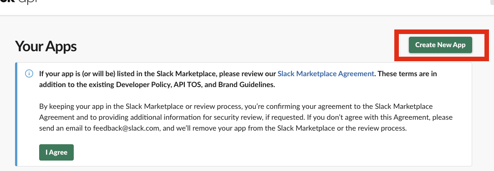
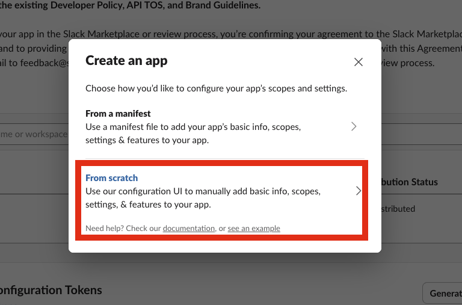
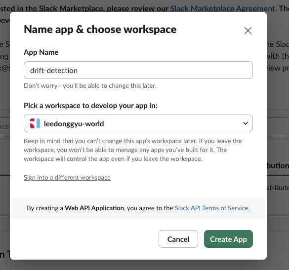
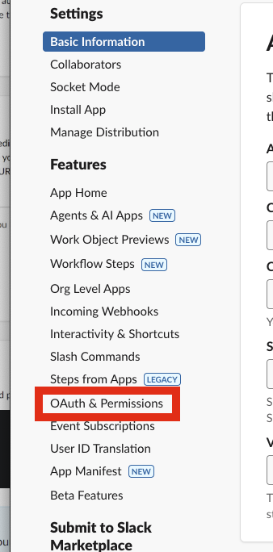
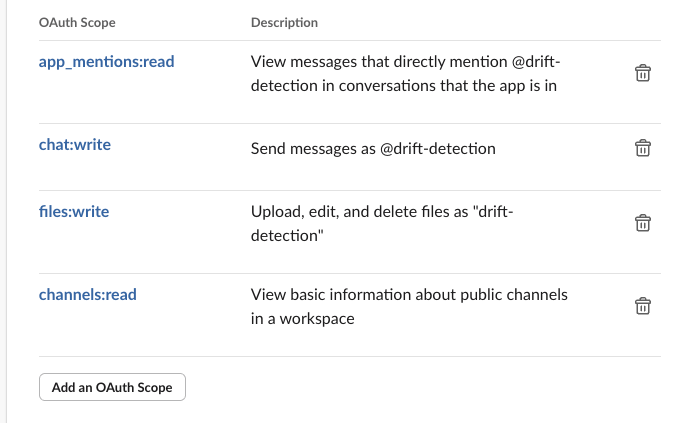
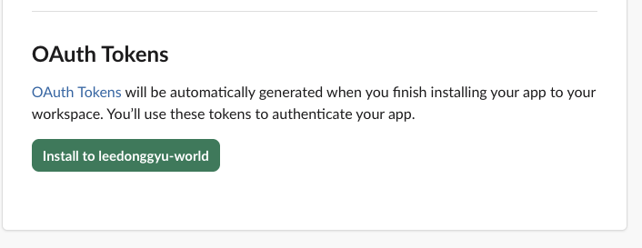
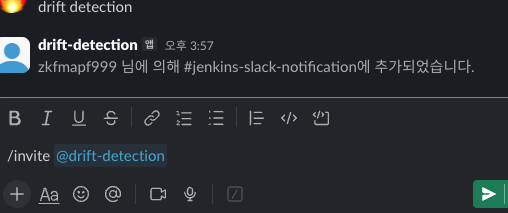

# AT-Atlantis-Drift-Detection

## Bot Token Required










## Parameters

| Flag | Short | Description | Example |
|------|-------|-------------|---------|
| `--github-token` | `-g` | The Github token | `ghp_xxx` |
| `--github-repo-ref` | `-f` | The Github repository reference | `main`, `master` |
| `--atlantis-url` | `-u` | The Atlantis URL | `https://atlantis.example.com` |
| `--atlantis-token` | `-t` | The Atlantis token | `your-api-secret` |
| `--atlantis-repository` | `-r` | Atlantis Repository | `owner/repo-name` |
| `--atlantis-config` | `-c` | Atlantis Config File | `atlantis.yaml` |
| `--slack-bot-token` | `-s` | Slack Bot Token | `xoxb-xxx` |
| `--slack-channel` | `-l` | Slack Channel | `C024BE91L` |

## Execute

```sh
    make build
    make run
```